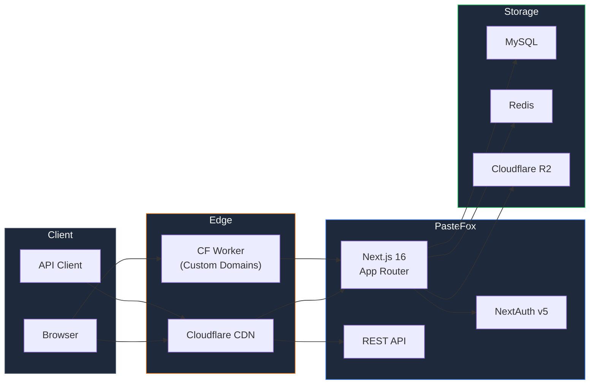

<div align="center">


# PasteFox

**Share Code & Text Instantly — Privacy-First, Developer-Friendly**

<br />

<a href="https://pastefox.com"></a>
<a href="https://pastefox.com/docs/api"></a>
<a href="https://pastefox.com/status"></a>
<a href="https://x.com/PasteFoxCo"></a>

<br /><br />


<br /><br />


---

*A modern pastebin for developers who care about privacy, speed, and beautiful code sharing.*
*No account required. No tracking. No ads. Just paste.*

</div>

<br />

## What is PasteFox?

[PasteFox](https://pastefox.com) is a modern code and text sharing platform. It's built for developers, teams, and anyone who needs to share snippets quickly and securely.

Unlike traditional pastebins, PasteFox offers client-side encryption, custom domains, folder organization, a full REST API, and fun reveal effects — all wrapped in a clean, fast UI powered by Next.js 16 and React 19.

> **Try it now:** [pastefox.com](https://pastefox.com) — paste something, get a link. That's it.

<br />

## Features

<table>
<tr>
<td width="50%">

### Privacy & Security
- **Client-side encryption** — encrypted before it leaves your browser
- **Password-protected pastes**
- **Burn after read** — one-time view, self-destructing
- **Max view limits** — auto-expire after N views
- **No tracking, no analytics, no data selling**
- **Cloudflare Turnstile** captcha (no reCAPTCHA)

</td>
<td width="50%">

### Code Experience
- **130+ languages** with syntax highlighting
- **Auto language detection**
- **Line numbers, search, word wrap**
- **Light & dark themes**
- **Raw view, embed, and print support**
- **CodeMirror 6** editor

</td>
</tr>
<tr>
<td width="50%">

### Organization
- **Folders & Collections** — organize like a file system
- **Pin folders to your profile**
- **Bulk operations** — move, delete, change visibility
- **Custom domains** — `paste.yourdomain.com`
- **Folder sharing** via token links
- **Public profiles** with paste showcase

</td>
<td width="50%">

### For Developers
- **Full REST API** with OpenAPI spec
- **API key auth** with rotation & rate limits
- **Clone any public paste**
- **Embed snippets** via iframe
- **8 languages** — EN, DE, FR, ES, PT, RU, AR, TR
- **Support system** with tickets & FAQ

</td>
</tr>
</table>

### Reveal Effects

Pastes can have fun reveal animations — your recipient has to interact before seeing the content:

| Scratch Card | Typewriter | Blur | Puzzle | Slots |
|:---:|:---:|:---:|:---:|:---:|
| Fireworks | Matrix | Glitch | Shake | Confetti |

<br />

## Architecture



<br />

## API Guide

PasteFox has a full REST API. Authenticate with an API key via the `X-API-Key` header.
Get your key at [pastefox.com/dashboard/api-keys](https://pastefox.com/dashboard/api-keys).

### Authentication

```
X-API-Key: pk_your_api_key_here
```

All API responses follow this format:
```json
{ "success": true, "data": { ... } }
```

### Create a Paste

```bash
curl -X POST https://pastefox.com/api/pastes \
  -H "Content-Type: application/json" \
  -H "X-API-Key: pk_your_api_key" \
  -d '{
    "title": "Hello World",
    "content": "console.log(\"Hello from PasteFox!\");",
    "language": "javascript",
    "visibility": "PUBLIC"
  }'
```

**Response:**
```json
{
  "success": true,
  "data": {
    "id": "cm...",
    "slug": "abc123",
    "title": "Hello World",
    "language": "javascript",
    "visibility": "PUBLIC",
    "viewCount": 0,
    "createdAt": "2026-03-28T12:00:00.000Z"
  }
}
```

### Get a Paste

```bash
curl https://pastefox.com/api/pastes/abc123 \
  -H "X-API-Key: pk_your_api_key"
```

### Get Raw Content

```bash
curl https://pastefox.com/api/pastes/abc123/raw
```

### List Your Pastes

```bash
curl "https://pastefox.com/api/pastes?page=1&limit=20&sortBy=createdAt&sortOrder=desc" \
  -H "X-API-Key: pk_your_api_key"
```

### Update a Paste

```bash
curl -X PATCH https://pastefox.com/api/pastes/abc123 \
  -H "Content-Type: application/json" \
  -H "X-API-Key: pk_your_api_key" \
  -d '{"title": "Updated Title", "visibility": "PRIVATE"}'
```

### Delete a Paste

```bash
curl -X DELETE https://pastefox.com/api/pastes/abc123 \
  -H "X-API-Key: pk_your_api_key"
```

### Self-Destructing Paste

```bash
curl -X POST https://pastefox.com/api/pastes \
  -H "Content-Type: application/json" \
  -H "X-API-Key: pk_your_api_key" \
  -d '{
    "content": "This message will self-destruct",
    "isOneTimeView": true,
    "expiresAt": "2026-12-31T23:59:59Z"
  }'
```

### Password-Protected Paste

```bash
curl -X POST https://pastefox.com/api/pastes \
  -H "Content-Type: application/json" \
  -H "X-API-Key: pk_your_api_key" \
  -d '{
    "content": "Secret stuff",
    "password": "hunter2",
    "visibility": "PRIVATE"
  }'
```

### Clone a Paste

```bash
curl -X POST https://pastefox.com/api/pastes/abc123/clone \
  -H "X-API-Key: pk_your_api_key"
```

<details>
<summary>Folder API</summary>

### List Folders

```bash
curl https://pastefox.com/api/folders \
  -H "X-API-Key: pk_your_api_key"
```

### Create Folder

```bash
curl -X POST https://pastefox.com/api/folders \
  -H "Content-Type: application/json" \
  -H "X-API-Key: pk_your_api_key" \
  -d '{"name": "My Scripts", "visibility": "PRIVATE"}'
```

### Create Paste in Folder

```bash
curl -X POST https://pastefox.com/api/pastes \
  -H "Content-Type: application/json" \
  -H "X-API-Key: pk_your_api_key" \
  -d '{
    "content": "#!/bin/bash\necho hello",
    "language": "bash",
    "folderId": "folder_id_here"
  }'
```

</details>

<details>
<summary>All Create Paste Options</summary>

| Field | Type | Default | Description |
|-------|------|---------|-------------|
| `content` | string | *required* | Paste content |
| `title` | string | `"Untitled"` | Title (max 255 chars) |
| `language` | string | auto-detect | Programming language |
| `visibility` | `PUBLIC` / `PRIVATE` | `PUBLIC` | Who can see it |
| `password` | string | — | Password protection (4-100 chars) |
| `expiresAt` | ISO 8601 | — | Auto-delete after this time |
| `maxViews` | integer | — | Auto-delete after N views |
| `isOneTimeView` | boolean | `false` | Delete after first view |
| `effect` | string | `NONE` | Reveal effect (see above) |
| `folderId` | string | — | Put paste in a folder |

</details>

> Full interactive API docs: [pastefox.com/docs/api](https://pastefox.com/docs/api)

<br />

## Supported Languages

PasteFox is available in 8 languages:

| English | Deutsch | Francais | Espanol |
|:---:|:---:|:---:|:---:|
| Portugues | Russkij | al-Arabiyya | Turkce |

<br />

## Roadmap

- [x] Client-side encryption
- [x] Custom avatar uploads
- [x] Profile view tracking
- [x] Paste embedding
- [x] Folder pinning on profiles
- [x] 8-language i18n
- [x] Custom domains
- [x] Support ticket system
- [ ] GitHub / GitLab OAuth
- [ ] Collaborative editing
- [ ] VS Code extension
- [ ] CLI tool
- [ ] Paste versioning / history
- [ ] Webhook notifications

<br />

## Contact

<div align="center">

<a href="https://pastefox.com"></a>
<a href="mailto:info@pastefox.com"></a>
<a href="https://x.com/PasteFoxCo"></a>
<a href="https://pastefox.com/support"></a>

</div>

<br />

---

<div align="center">

**Built with 🧡 by the PasteFox team in Germany**

<br />


<sub>2025-2026 PasteFox. All rights reserved.</sub>

<br />

<sub>Next.js 16 | React 19 | TypeScript | Tailwind CSS 4 | Prisma | Cloudflare</sub>

</div>
